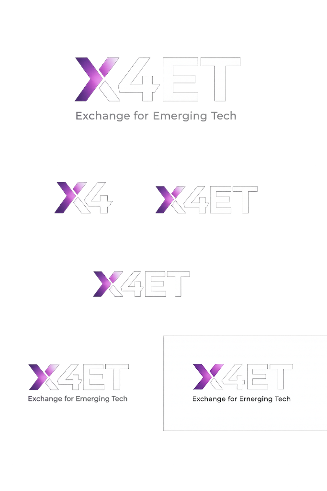

# X4ET - Exchange for Emerging Tech



## Overview

**X4ET** is an AI-Powered Technology Engagement Platform that bridges the gap between Technology Buyers and Technology Sellers through structured engagements, intelligent requirement analysis, and smart seller discovery.

## 🌟 Key Features

### For Technology Buyers
- **AI Requirement Structuring** - Transform vague requirements into structured, actionable specifications
- **Smart Seller Discovery** - Find qualified technology sellers based on competencies, certifications, and industry expertise
- **Engagement Management** - Track engagements through structured stages: Concept → Early Discussion → BRD → Pilot → RFP
- **AI-Powered Insights** - Get AI suggestions for solution architecture, pilot design, and proposal evaluation

### For Technology Sellers
- **Portfolio Management** - Showcase products, solutions, and technical capabilities
- **Certification Showcase** - Display ISO certifications, compliance audits, and industry credentials
- **Opportunity Discovery** - Receive matched buyer engagements based on your profile
- **Proposal Collaboration** - Work with buyers through structured engagement stages

### Platform Features
- **Engagement Workspace** - Shared collaboration space for buyers and sellers
- **Document Management** - BRD, proposals, technical architecture, and pilot designs
- **Stage Timeline** - Visual progress tracking through engagement stages
- **Advanced Filtering** - Filter by industry, technology, deployment model, and certifications
- **Dark Mode** - Full dark mode support for better user experience

## 🏭 Industries Served

- Manufacturing (Smart Factories, IoT, Automation)
- Oil & Gas (Pipeline Monitoring, Predictive Maintenance)
- Smart Cities (Urban Infrastructure, IoT Networks)
- Defense (Secure Systems, Advanced Technology)
- Infrastructure (Construction, Asset Management)

## 🛠 Technology Stack

- **Frontend Framework**: React 18
- **Build Tool**: Vite
- **Styling**: Tailwind CSS
- **Routing**: React Router DOM
- **Icons**: Lucide React
- **Deployment**: Modern SaaS architecture

## 🚀 Getting Started

### Prerequisites
- Node.js 18+ 
- npm or yarn

### Installation

1. Clone the repository:
```bash
git clone <repository-url>
cd x4et-platform
```

2. Install dependencies:
```bash
npm install
```

3. Start the development server:
```bash
npm run dev
```

4. Open your browser and navigate to `http://localhost:5173`

### Build for Production

```bash
npm run build
```

The production-ready files will be in the `dist` directory.

## 📁 Project Structure

```
x4et-platform/
├── public/                 # Static assets
│   └── logo-*.png         # X4ET logos
├── src/
│   ├── components/        # Reusable components
│   ├── layouts/           # Layout components
│   │   └── DashboardLayout.jsx
│   ├── pages/             # Page components
│   │   ├── Landing.jsx
│   │   ├── BuyerDashboard.jsx
│   │   ├── SellerDashboard.jsx
│   │   ├── EngagementWorkspace.jsx
│   │   └── TechnologyDiscovery.jsx
│   ├── data/              # Data files and mock data
│   ├── App.jsx            # Main application component
│   ├── main.jsx           # Application entry point
│   └── index.css          # Global styles
├── index.html             # HTML template
├── tailwind.config.js     # Tailwind configuration
├── vite.config.js         # Vite configuration
└── package.json           # Dependencies and scripts
```

## 🎨 Design Philosophy

The platform follows a **modern, enterprise-grade SaaS design** inspired by:
- **Notion** - Clean, minimal interface
- **Linear** - Focused task management
- **Stripe Dashboard** - Professional data visualization

### Design Principles
- Clean and minimal UI
- Card-based layouts
- Purple gradient theme (matching X4ET branding)
- Dark mode support
- Responsive design
- Enterprise-grade aesthetics
- Real industry imagery

## 🔑 Key User Flows

### Buyer Flow
1. Land on platform → Sign up as Buyer
2. Post new engagement with problem statement
3. AI structures requirement into actionable specs
4. Browse matched technology sellers
5. Initiate engagement with selected seller
6. Collaborate through engagement stages
7. Receive AI-powered insights and recommendations

### Seller Flow
1. Land on platform → Join as Technology Seller
2. Create portfolio with products/solutions
3. Upload certifications and compliance documents
4. Receive matched buyer opportunities
5. Respond to engagements
6. Collaborate through proposal and pilot stages
7. Leverage AI assistance for technical proposals

## 📊 Engagement Stages

1. **Concept** - Initial idea and feasibility discussion
2. **Early Discussion** - Preliminary technical exploration
3. **BRD** - Business Requirements Document development
4. **Pilot** - Proof of concept implementation
5. **RFP** - Request for Proposal and final selection

## 🔐 Future Enhancements

- Real-time collaboration features
- Advanced AI-powered requirement analysis
- Automated proposal generation
- Integration with enterprise systems (ERP, CRM)
- Video conferencing integration
- Advanced analytics and reporting
- Multi-language support
- Mobile applications

## 📄 License

Copyright © 2026 X4ET - Exchange for Emerging Tech. All rights reserved.

## 🤝 Support

For support, please contact: support@x4et.com

---

**Built with ❤️ for the emerging tech ecosystem**
